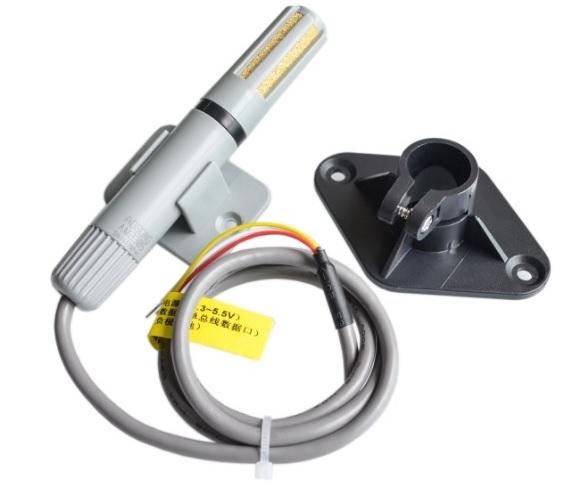

# DHT Library

* http://www.github.com/NimaLTD   
* https://www.instagram.com/github.nimaltd/   
* https://www.youtube.com/channel/UCUhY7qY1klJm1d2kulr9ckw   

This is the DHT (Humidity-Temperature) sensors STM32 HAL Library  

How to use this Library:
* Select "General peripheral Initalizion as a pair of '.c/.h' file per peripheral" on project settings.   
* Enable a gpio pin as external interrupt on both Rising and Falling edge.
* Enable a timer as normal mode.   
* Include Header and source into your project.   
* Config "dhtConf.h".   
* Create your DHT_t struct.   
* Put DHT_pinChangeCallBack(your struct) in external callback function.   
* Call DHT_init( .. .. .. ).   
* Read data by DHT_readData(*,*)

```
#include "DHT.h"
DHT_t     am2301;
bool      am2301_ok;
int main()
{
  DHT_init(&am2301,DHT_Type_AM2301,&htim7,72,AM2301_GPIO_Port,AM2301_Pin); 
  while(1)
  {
    HAL_Delay(5000);
    float t,h;
    am2301_ok = DHT_readData(&am2301,&t,&h);  
  }
}
```
<a ></a>
<a ></a>


